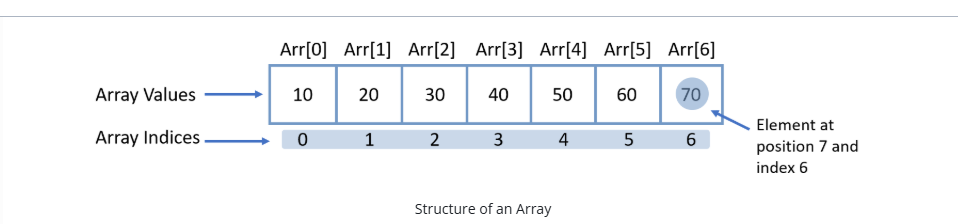
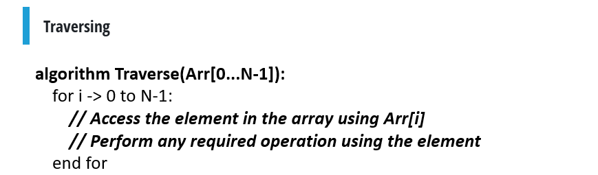

An array is a collection of items of the same type i.e. a collection of elements of a specific data type.
We can have arrays of different types:

An array of Integers.
An array of Floats.
An array of Booleans.

At a memory level, arrays are stored in contiguous locations i.e. all the elements are stored in adjacent memory locations and in order.

Types of Indexing

1. Zero-based Indexing: The index of the array starts from 0. This type of indexing is the most common type and seen in languages such as Java, C, C++, etc.
2. One-based Indexing: The index of the array starts from 1. This type of indexing is seen in languages such as R, MATLAB.
3. n-based Indexing: The indices in such languages can start and end at any integer value. This type of indexing is seen in languages such as Ada.

why is array indexing starting from zero ? 

https://developerinsider.co/why-does-the-indexing-of-array-start-with-zero-in-c/

Common Array Operations

Some commonly used array operations are:

1.Traversing: This is visiting each element in the array in order.
2.Insertion: An element can be inserted into the array at a specific index.
3.Deletion: An element can be deleted from a specific index in an array.
4.Updates: Update the value at a given index.
5.Sorting: The array can be reordered based on the values.
6.Searching: Find the index of an element given a value.

//Traversing an array 

In the above algorithm, N is the length of the array. Most languages will provide an interface to get the length of an array. For example, in Java, array.length (length property of the array class) will give you the length. In python, the len(list) function will give you the length of the list.
Note: Python lists are not pure arrays because they allow heterogeneous data types in them and don't always store elements in contiguous locations

lists in python store heterogeneous values why ? 
we dont define a variable type while decalring a variable in python 
like x = 10 
where the list has ( 12, -3, 76 , 9.4)
this all are stored as references like 

Address 5000 -> Integer 10

Address 6000 -> Integer 20

Address 7000 -> Integer 30

          List

      +-------+
Index | Ref   |
------+-------+
0     |5000| -----> Integer object (10)
1     |6000| -----> Integer object (20)
2     |7000| -----> Integer object (30)
      +-------+

lst = [10, "hello", 3.14]

5000 -> Integer object

6000 -> String object

7000 -> Float object

          List

      +-------+
0 --->|5000| ---------> Integer 10

1 --->|6000| ---------> String "hello"

2 --->|7000| ---------> Float 3.14
      +-------+
Every thing is a object in python 
even a variable declared 

why cant C arrays or java arrays can do this ?
int arr[3];
1000 : int
1004 : int
1008 : int
because this is how they are declared 

But why is python like this ? 

In Python, everything is an object:

integers
floats
strings
lists
dictionaries
functions
classes

Why does Python store references instead of values?

Python variables store references (addresses) to objects, not the actual values. This lets Python treat everything as an object, making it easy to support dynamic typing (different data types), automatic memory management, and efficient sharing of objects without unnecessary copying.

Insertion, Deletion, and Updation

For Insertion the provided input should be the following:
Array, the position at which the operation must be performed and the element to be inserted.
Note that for a 0-based indexed array, the index at which the insertion must be performed will be (position - 1).

Another point to note is for this to work, the array must have an empty space in order to perform the insert. This is to prevent an issue that commonly occurs in C-like languages called ArrayIndexOutOfBounds.

 Read about it here: https://www.educative.io/edpresso/what-is-the-arrayindexoutofbounds-exception-in-java#:~:text=The%20ArrayIndexOutOfBounds%20exception%20is%20thrown,for%20this%20error%20during%20compilation.

 ( in the above article ,to handle the exceptions even the try catch statement is explained in a very simple manner - refer that too )

Let's look at the algorithm for this. In the algorithm, we make the assumption position N is empty.